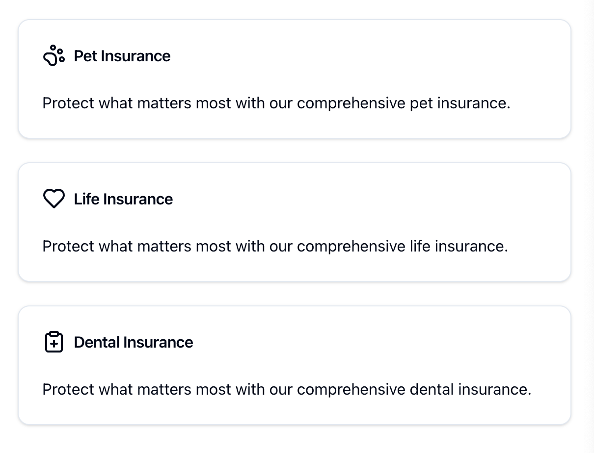
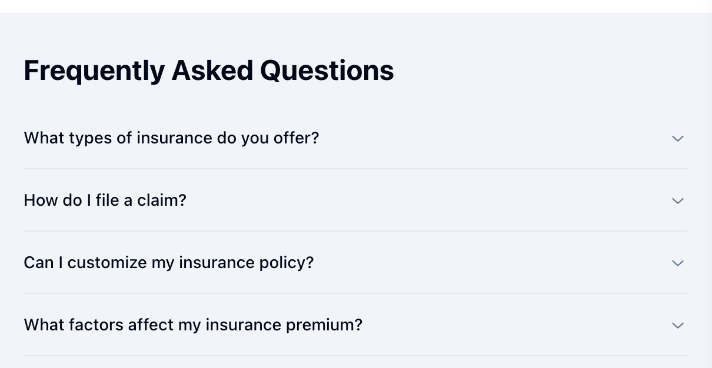

# Deploying the New Data Layer Object

This documentation provides instructions on deploying a new `digitalData` object that will populate on page load and during interactions with specific elements on your website. The `digitalData` pushes are the same object, with the `event` value differing based on whether it's a page load or an interaction with an element.

## Initialising the Data Layer

To initialise the `digitalData` object on your webpage, use the following script:

```javascript
window.digitalData = window.digitalData || [];
```

This script ensures that the `digitalData` array is available for pushing data objects whenever required.

## The `digitalData` Object Structure for event `interaction`

Below is the structure of the `digitalData` object that needs to be deployed. This example is for an interaction event:

```javascript
digitalData.push({
  "interaction": {
    "eventType": "button",        // e.g., "navbar", "buttonClick", "formSubmit"
    "clickText": "",              // Text displayed on the clickable element
    "clickSection": "",           // Section of the clickable element
    "clickURL": "",               // URL the element points to
    "search": {
      "autoSuggestSearchTerm": "",
      "searchTerm": "",
      "searchFilters": "",
    }
  },
 "page": {
    "pageInfo": {
      "pageName": "",
      "pageTitle": "",
      "pageType": "",
      "pageUrl": "",
      "mcode": "",
      "language": "",
      "primaryCategory": "",
      "subCategory1": "",
      "subCategory2": "",
      "subCategory3": "",
      "brand": "",
      "environment": "",
      "domain": "",
      "formName": "",
      "formStep": "",
      "formSubStep": "",
      "formSection": "",
      "quoteId": "",
      "applicationId": "",
      }
  },
  "user": {
    "profileInfo": {
      "phoneNumber": "",
      "membershipType": "",
      "membershipTypeId": "",
      "loginstatus": "",
    }
  },
  "event": "interaction"
});
```

---

## Developer Object Values Types

This will allow for developers to define the object types before pushing to production and encountering any type issues.

```javascript
 {
    interaction: {
      eventType: string;
      clickText: string;
      clickURL: string;
      clickSection: string;
      search: {
        autoSuggestSearchTerm: string;
        searchTerm: string;
        searchFilters: string;
      }
    };
"page": {
  pageInfo: {
      pageName: string;
      pageTitle: string;
      pageType: string;
      pageUrl: string;
      mcode: string;
      referrer: string;
      language: string;
      primaryCategory: string;
      subCategory1: string;
      subCategory2: string;
      subCategory3: string;
      brand: string;
      environment: string;
      domain: string;
      formName: string;
      formStep: string;
      formSubStep: string;
      quoteId: string;
      applicationId: "string";
      } 
    };
"user": {
  "profileInfo": {
      email: string;
      phoneNumber: string;
      membershipType: string;
      membershiptypeId: string;
      loginstatus: string;

    };
    event: string;
  }};
```
---

## Examples for Specific Elements

Below are examples of how to implement the `digitalData` object for various elements, along with sample payloads and images.

### 1. Navigation Bar

When a user interacts with the navigation bar, the `digitalData` object should capture relevant details.

**Example Payload:**

```javascript
{
    "interaction": {
        "eventType": "navigation",
        "clickText": "Insurance Products",
        "clickURL": "https://datalayer-test.com",
        "clickSection": "Header",
        "search": {
            "autoSuggestSearchTerm": "",
            "searchTerm": "",
            "searchFilters": "",
        },
    },
"page": {
    "pageInfo": {
        "pageName": "Test Website",
        "pageTitle": "Test Website",
        "pageType": "Insurance Info",
        "pageUrl": "https://datalayer-test.com",
        "mcode": "insurancePage",
        "language": "en-AU",
        "primaryCategory": "Insurance",
        "subCategory1": "",
        "subCategory2": "",
        "subCategory3": "",
        "brand": "TAL",
        "environment": "production",
        "domain": "datalayer-test.com"
        "formName": "",
        "formStep": "",
        "formSubStep": "",
        "quoteId": "",
        "applicationId": "";
        }
    },
"user": {
    "profileInfo": {
        "email": "",
        "phoneNumber": "",
        "membershipType": "",
        "membershipId": "",
        "loginstatus": "",
        }
    },
    "event": "interaction"
}
```
**Image Illustration:**


---

### 2. Card

For interactions with cards, such as clicking on a product card, details should be captured accordingly.

**Example Payload:**

```javascript
{
    "interaction": {
        "eventType": "Card",
        "clickText": "Pet Insurance",
        "clickURL": "https://datalayer-test.com",
        "clickSection": "Header",
        "search": {
            "autoSuggestSearchTerm": "",
            "searchTerm": "",
            "searchFilters": "",
        },
    },
"page": {
    "pageInfo": {
        "pageName": "Test Website",
        "pageTitle": "Test Website",
        "pageType": "Insurance Info",
        "pageUrl": "https://datalayer-test.com",
        "mcode": "insurancePage",
        "language": "en-AU",
        "primaryCategory": "Insurance",
        "subCategory1": "",
        "subCategory2": "",
        "subCategory3": "",
        "brand": "TAL",
        "environment": "production",
        "domain": "datalayer-test.com"
        "formName": "",
        "formStep": "",
        "formSubStep": "",
        "quoteId": "",
        "applicationId": "";
        }
    },
"user": {
    "profileInfo": {
        "email": "",
        "phoneNumber": "",
        "membershipType": "",
        "membershipId": "",
        "loginstatus": "",
        }
    },
    "event": "interaction"
}
```
**Image Illustration:**



---

### 3. Button (CTA)

Capturing interactions with call-to-action buttons is essential for tracking user engagement.

**Example Payload:**

```javascript
{
    "interaction": {
        "eventType": "button",
        "clickText": "get a quote now",
        "clickURL": "https://datalayer-test.com",
        "clickSection": "Content",
        "search": {
            "autoSuggestSearchTerm": "",
            "searchTerm": "",
            "searchFilters": "",
        },
    },
"page": {
    "pageInfo": {
        "pageName": "Test Website",
        "pageTitle": "Test Website",
        "pageType": "Insurance Info",
        "pageUrl": "https://datalayer-test.com",
        "mcode": "insurancePage",
        "language": "en-AU",
        "primaryCategory": "Insurance",
        "subCategory1": "",
        "subCategory2": "",
        "subCategory3": "",
        "brand": "TAL",
        "environment": "production",
        "domain": "datalayer-test.com"
        "formName": "",
        "formStep": "",
        "formSubStep": "",
        "quoteId": "",
        "applicationId": "";
        }
    },
"user": {
    "profileInfo": {
        "email": "",
        "phoneNumber": "",
        "membershipType": "",
        "membershipId": "",
        "loginstatus": "",
        }
    },
    "event": "interaction"
}
```
**Image Illustration:**


---

### 4. Accordion

When users interact with accordion elements, such as expanding or collapsing sections, record the actions.

**Example Payload:**

```javascript
{
    "interaction": {
        "eventType": "accordion",
        "clickText": "FAQ: How do I file a claim?",
        "clickURL": "https://datalayer-test.com",
        "clickSection": "content",
        "search": {
            "autoSuggestSearchTerm": "",
            "searchTerm": "",
            "searchFilters": "",
        },
    },
"page": {
    "pageInfo": {
        "pageName": "Test Website",
        "pageTitle": "Test Website",
        "pageType": "Insurance Info",
        "pageUrl": "https://datalayer-test.com",
        "mcode": "insurancePage",
        "language": "en-AU",
        "primaryCategory": "Insurance",
        "subCategory1": "",
        "subCategory2": "",
        "subCategory3": "",
        "brand": "TAL",
        "environment": "production",
        "domain": "datalayer-test.com"
        "formName": "",
        "formStep": "",
        "formSubStep": "",
        "quoteId": "",
        "applicationId": "";
        }
    },
"user": {
    "profileInfo": {
        "email": "",
        "phoneNumber": "",
        "membershipType": "",
        "membershipId": "",
        "loginstatus": "",
        }
    },
    "event": "interaction"
}
```
**Image Illustration:**



---

### 5. Search Bar

For interactions with the search bar, including the terms entered and the results, the data captured helps in understanding user intent and improving search functionality.

**Example Payload:**

```javascript
{
    "interaction": {
        "eventType": "search",
        "clickText": "",
        "clickURL": "https://datalayer-test.com",
        "clickSection": "content",
        "search": {
            "autoSuggestSearchTerm": "",
            "searchTerm": "",
            "searchFilters": "",
        },
    },
"page": {
    "pageInfo": {
        "pageName": "Test Website",
        "pageTitle": "Test Website",
        "pageType": "Insurance Info",
        "pageUrl": "https://datalayer-test.com",
        "mcode": "insurancePage",
        "language": "en-AU",
        "primaryCategory": "Insurance",
        "subCategory1": "",
        "subCategory2": "",
        "subCategory3": "",
        "brand": "TAL",
        "environment": "production",
        "domain": "datalayer-test.com"
        "formName": "",
        "formStep": "",
        "formSubStep": "",
        "quoteId": "",
        "applicationId": "";
        }
    },
"user": {
    "profileInfo": {
        "email": "",
        "phoneNumber": "",
        "membershipType": "",
        "membershipId": "",
        "loginstatus": "",
        }
    },
    "event": "interaction"
}
```
**Image Illustration:**


---

### 5. Form Submission

For interactions with the forms, this will populate the object form with its proeprty values, depending on the step. This will mean there will be a new datalayer push for every new step in the form the user is in

**Example Payload:**

```javascript
{
    "interaction": {
        "eventType": "button",
        "clickText": "Next",
        "clickURL": "https://datalayer-test.com",
        "clickSection": "content",
        "search": {
            "autoSuggestSearchTerm": "",
            "searchTerm": "",
            "searchFilters": "",
        },
    },
"page": {
    "pageInfo": {
        "pageName": "Test Website",
        "pageTitle": "Test Website",
        "pageType": "Insurance Info",
        "pageUrl": "https://datalayer-test.com",
        "mcode": "insurancePage",
        "language": "en-AU",
        "primaryCategory": "Insurance",
        "subCategory1": "",
        "subCategory2": "",
        "subCategory3": "",
        "brand": "TAL",
        "environment": "production",
        "domain": "datalayer-test.com"
        "formName": "",
        "formStep": "",
        "formSubStep": "",
        "quoteId": "",
        "applicationId": "";
        }
    },
"user": {
    "profileInfo": {
        "email": "",
        "phoneNumber": "",
        "membershipType": "",
        "membershipId": "",
        "loginstatus": "",
        }
    },
    "event": "interaction"
}
```
**Image Illustration:**


---

## The `digitalData` Object Structure for event `page view`


Below is the structure of the `digitalData` object that needs to be deployed. This example is for a page load for an authenticated user:


```javascript
digitalData.push({
"page": {
  "pageInfo": {
      "pageName": "DataLayer Test Home",
      "pageTitle": "DataLayer Test - Home",
      "pageType": "homepage",
      "pageUrl": "https://datalayer-test.com",
      "mcode": "MC-67890",
      "language": "en-AU",
      "primaryCategory": "Data Analytics",
      "subCategory1": "Tracking",
      "subCategory2": "Data Layer Implementation",
      "subCategory3": "",
      "brand": "DataLayer Test",
      "environment": "production",
      "domain": "datalayer-test.com"
      "formName": "",
      "formStep": "",
      "formSubStep": "",
      "quoteId": "",
      "applicationId": "",
      }
  },
  "user": {
    "profileInfo": {
      "phoneNumber": "",
      "membershipType": "broker",
      "membershipTypeId": "123456",
      "loginstatus": "yes",
      }
  },
  "event": "pageView"
});
```


## Notes

- **Consistency**: Ensure all data pushed to the `digitalData` object is accurate and consistently formatted.
- **Placeholder Values**: Replace placeholder values (e.g., empty strings, comments) with actual data relevant to the user's interaction and the page context.


